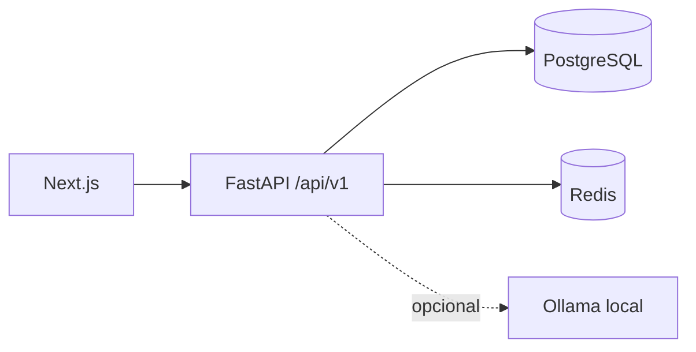

# Arquitetura

## Visão geral

O Big Tech Jobs começa como um monólito modular em monorepo. O backend FastAPI é a fonte dos contratos e regras de negócio; o frontend Next.js consome a API versionada. PostgreSQL é a fonte de verdade, enquanto Redis será usado apenas para estado efêmero, locks e evolução do processamento assíncrono.

## Limites atuais

- `apps/api`: API, configurações, integração de infraestrutura e, nas próximas etapas, módulos de domínio.
- `apps/web`: interface web e proxy same-origin para a API.
- `docs`: requisitos, decisões, roadmap e estado da implementação.

Não há microserviços. Workers separados só serão introduzidos quando tarefas reais e duráveis justificarem o custo operacional.

## Health checks

- `GET /api/v1/health/live`: confirma que o processo da API está vivo.
- `GET /api/v1/health`: informa o estado individual de PostgreSQL, Redis e Ollama.
- `GET /api/v1/health/ready`: retorna sucesso apenas quando as dependências obrigatórias estão disponíveis.

PostgreSQL e Redis são obrigatórios. Ollama é opcional e sua indisponibilidade degrada apenas recursos que dependam do modelo.

## Comunicação web/API

O navegador usa o caminho same-origin `/backend/*`. O servidor Next.js encaminha a requisição para `API_INTERNAL_URL`, reduzindo a superfície de CORS e evitando expor endereços internos ao cliente.

## Evolução prevista

As próximas fases adicionam módulos internos para identidade, perfis, vagas, matching, execuções, currículos e candidaturas. Cada módulo deverá preservar isolamento por usuário e contratos explícitos.

## Identidade e perfil

A Fase 1B adiciona `UserAccount`, `UserSession`, `UserProfile`, `WorkExperience`, `Project`, `Education`, `Skill`, `Language`, `Certification`, `ProfessionalLink`, `CareerGoal` e `JobSearchPreference`. Todo recurso mutável contém `user_id`, e as consultas combinam o identificador do recurso com o usuário da sessão; uma tentativa de acesso cruzado responde como recurso inexistente.

O cookie contém um token aleatório opaco. Somente o hash SHA-256 é persistido; a senha é derivada com Argon2. O cookie é `HttpOnly`, `SameSite=Lax` e passa a exigir HTTPS quando `SESSION_COOKIE_SECURE=true`.

A tela usa o proxy same-origin já definido na Fase 1A. O progresso do onboarding é persistido no perfil, enquanto a completude é recalculada a partir dos dados aprovados pelo usuário.
